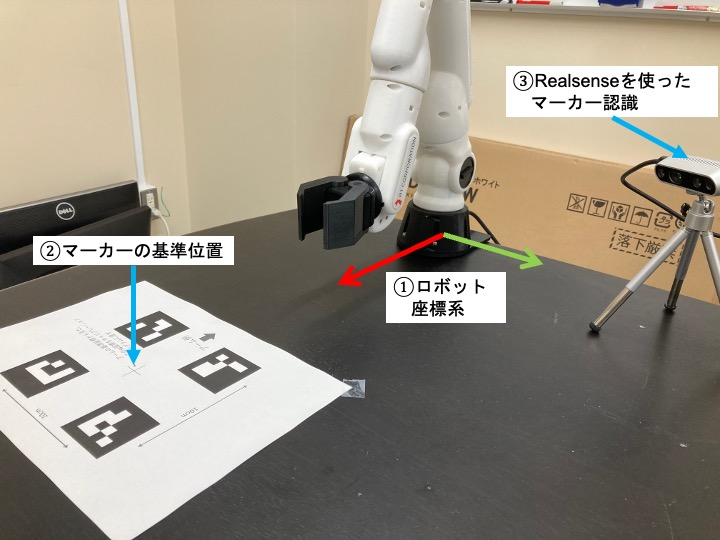

# カメラとアームのキャリブレーション

物体を掴むためには，カメラの座標系から見た物体座標を，アームの座標系から見た座標へと変換する必要があります．
[このプログラム](scripts/camera_calibration.py)は，この変換行列をARマーカーから推定するプログラムです．

## 準備
[ここ](https://github.com/naka-lab/ros_vision)の準備に従って，Realsenseと画像認識パッケージを動くようにする

## キャリブレーション手順
1. 下の画像のように[キャリブレーション用ARマーカー](scripts/cabration_marker.pdf)を設置して，ロボットの基準座標系（図中の①）から見たマーカーの基準位置（図中の②）のxy座標を確認する
2. Realsenseを使ったマーカー認識を実行
  ```
  rosrun ros_vision ar_marker_recognition.py 
  ```
3. キャリブレーションプログラムを実行．引数は，手順1で確認したxy座標．
  ```
  rosrun ros_manipulation camera_calibration.py 0.37 0
  ```
4. 実行後表示されたコマンドをコピーして実行．
  ```
  rosrun tf static_transform_publisher 0.0354 -0.1414 0.1211 -1.3768 0.1132 -1.9365 /base_link /camera_depth_optical_frame 100
  ```



5. /camera_linkも必要であれば以下を実行（物体を掴むだけなら必要ない）
  ```
  rosrun tf static_transform_publisher 0 0 0 0 -1.57 1.57  /camera_depth_optical_frame /camera_link 100
  ```
